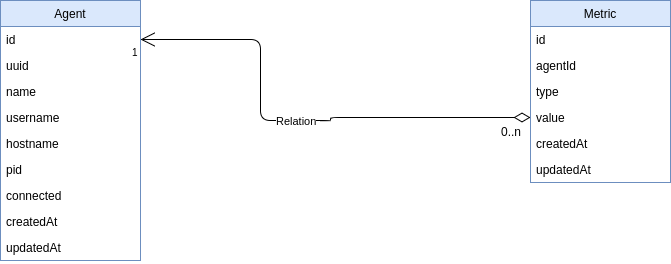

# thingsverse-db

## Usage

```js

const setupDatabase = require('thingsverser-db')

setupDatabase(config).then(db => {
    const { Agent, Metric } = db
    ...
}).catch(err => console.error(err))
```

## Entities
